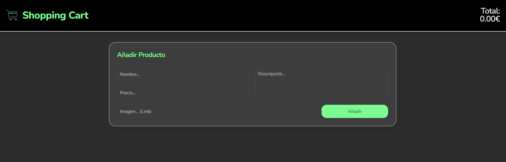
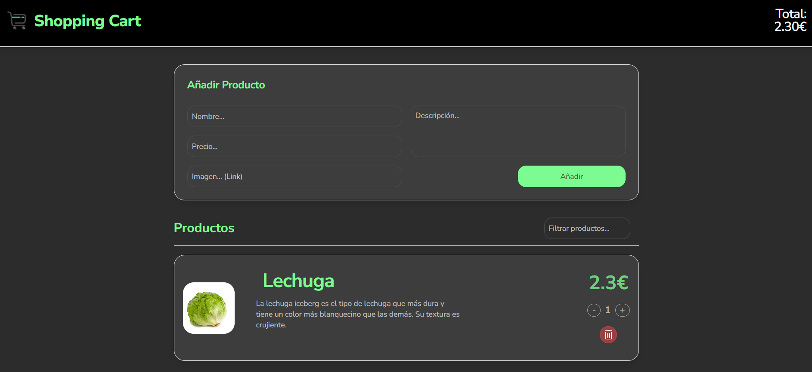

# Shopping Cart App


## Descripción

Esta aplicación es un carrito de compras interactivo creado como proyecto final de módulo utilizando tecnologías modernas como React y Tailwind CSS. El objetivo principal de la aplicación es permitir a los usuarios agregar productos a un carrito de compras, modificar las cantidades de los productos y calcular el precio total en tiempo real.

## Características

- **Añadir Productos**: Los usuarios pueden agregar productos al carrito mediante un formulario que solicita el nombre del producto, precio, descripción breve e imagen (link).
- **Modificar Cantidades**: Los usuarios pueden ajustar la cantidad de cada producto en el carrito.
- **Eliminar Productos**: Los usuarios pueden eliminar productos del carrito.
- **Cálculo del Total**: El precio total se actualiza automáticamente a medida que se agregan, eliminan o modifican productos.
- **Filtrado de Productos**: Los usuarios pueden filtrar los productos en la lista.

## Tecnologías Utilizadas

- **React**: Biblioteca de JavaScript para construir interfaces de usuario.
- **Tailwind CSS**: Framework de CSS para diseñar rápidamente.
- **Shadcn**: Biblioteca de componentes de UI.
- **React Transition Group**: Biblioteca para animaciones en React.
- **Vite**: Herramienta de construcción rápida para proyectos de front-end.

## Capturas de Pantalla


*Pantalla de inicio de la aplicación con el formulario para añadir productos.*


*Lista de productos añadidos al carrito con la opción de modificar cantidades y eliminar productos.*

## Instalación

Sigue estos pasos para configurar y ejecutar el proyecto en tu entorno local:

1. **Clonar el repositorio:**
    ```bash
    git clone https://github.com/miguelcalvoruiz/shopping-cart-app-shadcn.git
    cd shopping-cart-app-shadcn
    ```

2. **Instalar las dependencias:**
    ```bash
    npm install
    ```

3. **Ejecutar la aplicación en modo desarrollo:**
    ```bash
    npm run dev
    ```

4. **Construir la aplicación para producción:**
    ```bash
    npm run build
    ```

5. **Previsualizar la construcción de producción:**
    ```bash
    npm run preview
    ```

## Despliegue

Esta aplicación está configurada para ser desplegada en GitHub Pages. Para desplegar la aplicación, sigue estos pasos:

1. **Configurar la base URL en `vite.config.js`:**
    ```javascript
    export default defineConfig({
      base: '/shopping-cart-app-shadcn/',
      plugins: [react()],
      resolve: {
        alias: {
          "@": path.resolve(__dirname, "./src"),
        },
      },
    })
    ```

2. **Agregar el script de despliegue en `package.json`:**
    ```json
    "scripts": {
      ...
      "deploy": "gh-pages -d dist"
    }
    ```

3. **Desplegar la aplicación:**
    ```bash
    npm run build
    npm run deploy
    ```

## Contribución

Si deseas contribuir a este proyecto, por favor sigue estos pasos:

1. **Fork el repositorio.**
2. **Crea una nueva rama:**
    ```bash
    git checkout -b feature/nueva-funcionalidad
    ```
3. **Realiza los cambios y commitea:**
    ```bash
    git commit -m 'Añadir nueva funcionalidad'
    ```
4. **Sube los cambios a tu rama:**
    ```bash
    git push origin feature/nueva-funcionalidad
    ```
5. **Abre un Pull Request.**

## Licencia

Este proyecto está licenciado bajo la [MIT License](./LICENSE).

## Contacto

Miguel Calvo Ruiz - [miguelcalvoruiz](https://miguelcalvoruiz.github.io/PortfolioAngular/)
